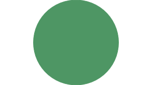
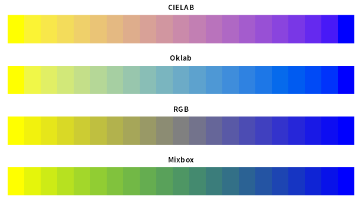
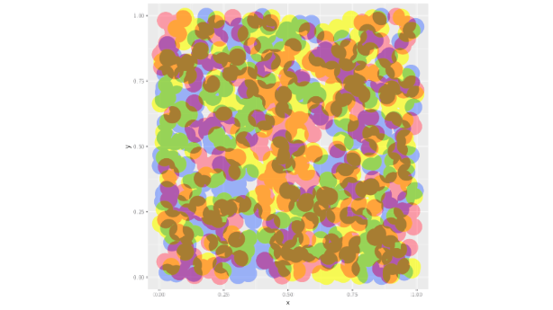

# mixboxr


<!-- README.md is generated from README.Rmd. Please edit that file -->

<!-- badges: start -->

[](https://lifecycle.r-lib.org/articles/stages.html#experimental)
<!-- badges: end -->

mixboxr is an R package for mixing two colors using the
[Mixbox](https://scrtwpns.com/mixbox/) algorithm. It is a wrapper around
their C/C++ implementation.

## Usage

``` r
pkgload::load_all(export_all = FALSE)
#> ℹ Loading mixboxr
library(colorfast)

# mix 50% yellow and 50% blue, resulting in green with Mixbox
mixed <- mixboxr::lerp("yellow", "blue", 0.5)
mixed
#> [1] -10185138

# for comparison, here we interpolate between the same colors with `scales::colour_ramp()`.
# this is done in CIELAB color space
ramped <- scales::colour_ramp(c("yellow", "blue"))(0.5)

grid::grid.newpage()
grid::grid.circle(x = 0.25, y = 0.5, r = 0.3, gp = grid::gpar(col = int_to_col(mixed), fill = int_to_col(mixed)))
grid::grid.circle(x = 0.75, y = 0.5, r = 0.3, gp = grid::gpar(col = ramped, fill = ramped))
```



``` r
interp_lab <- scales::col_mix("yellow", "blue", seq(0, 1, length.out = 21), space = "lab")
interp_oklab <- scales::col_mix("yellow", "blue", seq(0, 1, length.out = 21), space = "oklab")
interp_rgb <- scales::col_mix("yellow", "blue", seq(0, 1, length.out = 21), space = "rgb")
interp_mixbox <-
  purrr::map_int(seq(0, 1, length.out = 21), \(t) {
    mixboxr::lerp("yellow", "blue", t)
  }) |>
  colorfast::int_to_col()

opar <- par(mfrow = c(4, 1), mar = c(1, 1, 2, 1))
image(1:21, 1, as.matrix(1:21), col = interp_lab, axes = FALSE, main = "CIELAB")
image(1:21, 1, as.matrix(1:21), col = interp_oklab, axes = FALSE, main = "Oklab")
image(1:21, 1, as.matrix(1:21), col = interp_rgb, axes = FALSE, main = "RGB")
image(1:21, 1, as.matrix(1:21), col = interp_mixbox, axes = FALSE, main = "Mixbox")
```



``` r
par(opar)
```

``` r
library(ggplot2)

cap <- ragg::agg_capture()

rasts <-
  data.frame(
    x = runif(1000),
    y = runif(1000),
    col = sample(c("red", "yellow", "blue"), 1000, replace = TRUE)
  ) |>
  dplyr::group_by(col) |>
  dplyr::group_map(~ {
    gp <- ggplot(.) +
      geom_point(aes(x = x, y = y, colour = .y$col), size = 12) +
      scale_color_identity() +
      scale_size_identity()
    print(gp)
    cap(native = TRUE)
  })

dev.off()
#> agg_png 
#>       2

result <- purrr::reduce(rasts, ~ mixboxr::lerp(.x, .y, 0.5))
grid::grid.newpage()
grid::grid.raster(result, interpolate = TRUE)
```



## License

This package is licensed under the [Creative Commons
Attribution-NonCommercial 4.0 International
License](https://creativecommons.org/licenses/by-nc/4.0/).
